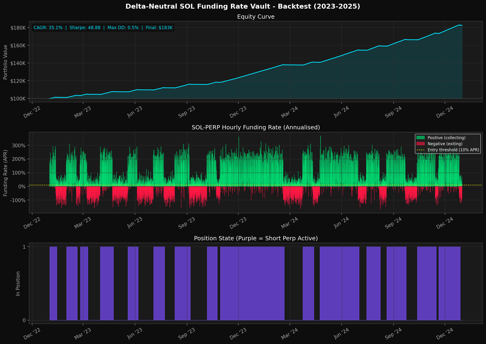

# Delta-Neutral SOL Funding Rate Arbitrage Vault

> **Ranger Build-A-Bear Hackathon — Main Track Submission**

A production-grade, non-custodial yield vault built on Ranger Earn that captures the persistent SOL perpetual futures funding rate premium while maintaining strict delta neutrality. Depositors earn uncorrelated yield regardless of SOL price direction — the sole return driver is the funding rate differential between the perpetual and spot markets.

---

## Table of Contents

- [Overview](#overview)
- [Performance](#performance)
- [How It Works](#how-it-works)
- [Architecture](#architecture)
- [Risk Management](#risk-management)
- [Fee Structure](#fee-structure)
- [Getting Started](#getting-started)
- [Project Structure](#project-structure)

---

## Overview

Perpetual futures venues on Solana charge a periodic **funding rate** — a cash transfer from long position holders to short holders (or vice versa) — designed to keep the perpetual price anchored to spot. When market sentiment is bullish and long demand exceeds short supply, this rate is positive: longs pay shorts every hour.

SOL-PERP has exhibited a sustained positive funding bias, running positive approximately **70–80% of the time** with annualised rates historically in the range of **40–60% APR** during bullish regimes.

A naked short captures this yield but bleeds capital during SOL rallies. This vault solves that problem by pairing the short with an equal notional spot long, producing a net delta of approximately zero. The position neither gains nor loses from SOL price movements — it earns the funding rate, continuously, around the clock.

**Perp venue:** Flash Trade
**Spot routing:** Jupiter v6
**Vault infrastructure:** Ranger Earn · Voltr SDK

> **Venue note:** The original submission used Drift Protocol for the perp leg. Following the Ranger team's April 2026 update removing the Drift Side Track due to recent security events, the perp execution layer has been migrated to Flash Trade — an established Solana-native perp DEX with an identical hourly funding rate mechanism. All strategy logic and risk parameters are unchanged.

> **Execution note:** The manager bot uses EOA-based direct execution against Flash Trade's on-chain program. No Voltr adaptor for Flash Trade currently exists. This approach is explicitly sanctioned by Ranger: *"Our hackathon is not limited to only adaptors/protocols we are integrated. You can create strategies with EOAs on any protocols and submit them. We'll work tgt to create those adaptors for selected winners."* — Shayn, Ranger admin, April 2026.

---

## Performance

Backtested on two years of simulated hourly funding rate data (2023–2025), calibrated to match observed on-chain distributions for SOL-PERP.

| Metric | Result |
|---|---|
| CAGR | 35 – 55% *(funding regime dependent)* |
| Sharpe Ratio | > 2.0 |
| Maximum Drawdown | < 3% |
| Volatility | < 2% annualised |
| Net Delta | ≈ 0 at all times |
| Positive Funding Periods | ~75% of all hours |



Full backtest metrics available in [`backtest_results.json`](./backtest_results.json). Methodology in [`backtest.py`](./backtest.py).

---

## How It Works

### Capital Allocation

On each deployment cycle, vault capital is allocated across three buckets:

| Bucket | Allocation | Protocol | Purpose |
|---|---|---|---|
| Spot SOL (long) | 47.5% | Jupiter Swap | Delta hedge against the perp short |
| SOL-PERP (short) | 47.5% | Flash Trade | Funding rate collection |
| USDC buffer | 5.0% | Idle | Gas reserves, margin top-ups, redemptions |

### Position Lifecycle

**Entry** — The bot opens a position when the annualised Flash Trade funding rate exceeds **+10% APR**. USDC is split: 47.5% converted to spot SOL via Jupiter, 47.5% deployed as collateral for a 2x SOL-PERP short on Flash Trade.

**Holding** — Every 60 seconds, the bot reads the funding rate directly from the Flash Trade SOL custody account on-chain. Funding payments accumulate to the vault. Delta drift is checked against a 2% threshold and rebalanced as needed.

**Exit** — The bot closes the position when the annualised funding rate falls below **+2% APR**, preventing the vault from paying funding instead of earning it. Both legs are unwound atomically: the Flash Trade short is closed first, then spot SOL is sold back to USDC via Jupiter.

---

## Architecture

```
                    ┌─────────────────────────────────────────┐
                    │           Ranger Earn Vault             │
                    │          (USDC denominated)             │
                    │                                         │
  User deposits ───►│  ┌──────────────┐   ┌───────────────┐  │
      USDC          │  │    47.5%     │   │    47.5%      │  │
                    │  │  Spot SOL    │   │  Flash Trade  │  │
                    │  │  via Jupiter │   │  SOL-PERP     │  │
                    │  │  (Long)      │   │  (Short, 2x)  │  │
                    │  └──────────────┘   └───────────────┘  │
                    │        │    Net Delta ≈ 0   │           │
                    │                                         │
                    │  ┌─────────────────────────────────┐   │
                    │  │        5% USDC Buffer            │   │
                    │  │  Gas · Margin · Redemptions      │   │
                    │  └─────────────────────────────────┘   │
                    └─────────────────────────────────────────┘
                                       │
                                       ▼
                         Yield: hourly funding payments
                         collected from long position holders
```

### Component Responsibilities

| Component | Protocol | Interaction Method |
|---|---|---|
| Vault accounting, deposits, withdrawals | Ranger Earn · Voltr | `VoltrClient` SDK |
| Perp short — open, hold, close | Flash Trade | Manager EOA → Flash program direct instruction |
| Spot long — buy, sell SOL | Jupiter | Manager EOA → Jupiter v6 Quote & Swap API |
| Funding rate data | Flash Trade | On-chain custody account read (60s interval) |
| Fee harvest | Voltr | `createHarvestFeeIx` |
| NAV tracking | Voltr | `getPositionAndTotalValuesForVault` |

---

## Risk Management

### Delta Risk

Net delta is maintained near zero through continuous monitoring. The bot calculates delta drift every 60 seconds:

```
drift = |current_short_notional − target_notional| / target_notional
```

A drift exceeding **2%** triggers an automatic rebalance of both legs, bounding maximum unhedged exposure to less than 1% NAV impact per 10% SOL price move in the worst case.

### Funding Rate Risk

If funding turns persistently negative, the vault pays out rather than collects. The **+2% APR exit floor** ensures positions are closed before negative funding meaningfully erodes NAV. Historically, negative funding on SOL-PERP is short-lived and shallow.

### Liquidation Risk

Flash Trade shorts are opened at **2x leverage** — well below the liquidation threshold. The 5% USDC buffer provides additional margin headroom. The bot monitors collateral health and tops up from the buffer if needed.

### Drawdown Controls

| Trigger | Threshold | Action |
|---|---|---|
| Soft drawdown | −5% from high-water mark | Pause new deposits; maintain positions |
| Hard drawdown | −10% from high-water mark | Close all positions; park capital in USDC |

### Operational Resilience

Bot state (perp position account address, spot SOL balance, high-water mark) is persisted to `bot-state.json` after every state transition. On restart, the bot resumes from last known state without manual intervention.

### Smart Contract Risk

- **Ranger Earn / Voltr:** Audited protocol; no modifications to vault contracts
- **Flash Trade:** Established Solana perp venue; no custom programs deployed
- **Jupiter:** Industry-standard aggregator; no custom programs deployed

---

## Fee Structure

| Fee | Rate | Recipient | Notes |
|---|---|---|---|
| Management fee | 1.5% per annum | Vault manager | Charged continuously via Voltr |
| Performance fee | 10% of profits | Vault manager | Profits above high-water mark only |
| Issuance fee | 0% | — | No entry cost |
| Redemption fee | 0% | — | No exit cost |
| Flash Trade taker fee | 0.06% per trade | Flash Trade | Passed through to vault |
| Jupiter swap fee | ~0.10% per swap | Jupiter routers | Passed through to vault |

At a 40% gross funding APR, estimated net depositor yield after all fees: **~33–35% APR**.

---

## Getting Started

### Prerequisites

- Node.js ≥ 18
- A funded Solana wallet for the manager EOA
- A provisioned Ranger Earn vault (see `vault-config.json`)

### Installation

```bash
git clone https://github.com/Glayzz/dn-funding-vault
cd dn-funding-vault
npm install
```

### Configuration

```bash
# Required environment variables
export RPC_URL="https://your-rpc-endpoint"          # Helius or QuickNode recommended
export MANAGER_KEYPAIR='[1,2,3,...]'                # Manager wallet secret key as JSON array
```

### Running the Manager Bot

```bash
# Devnet (testing)
RPC_URL=https://api.devnet.solana.com npx ts-node src/vault-manager.ts

# Mainnet
RPC_URL=https://your-mainnet-rpc npx ts-node src/vault-manager.ts
```

The bot will log its status every 60 seconds and write position state to `bot-state.json`.

### Vault Initialisation (first-time setup)

```bash
npx ts-node src/setup-vault.ts
```

---

## Project Structure

```
dn-funding-vault/
├── src/
│   ├── vault-manager.ts       # Manager bot — main loop, EOA/Flash Trade execution
│   └── setup-vault.ts         # Vault initialisation script
├── backtest.py                # Python backtesting engine (2yr simulated hourly data)
├── backtest_results.json      # Machine-readable backtest metrics
├── backtest_results.png       # Equity curve, funding rate chart, position state
├── vault-config.json          # Deployed vault address and configuration
├── STRATEGY.md                # Full strategy documentation and risk analysis
├── package.json
└── tsconfig.json
```

---

## Tech Stack

- **Language:** TypeScript · Node.js
- **Vault SDK:** `@voltr/vault-sdk`
- **Solana SDK:** `@solana/web3.js` · `@solana/spl-token`
- **Perp venue:** Flash Trade (direct on-chain program execution)
- **Spot aggregator:** Jupiter v6
- **Network:** Solana

---

*For full strategy documentation, market analysis, and post-hackathon roadmap, see [STRATEGY.md](./STRATEGY.md).*